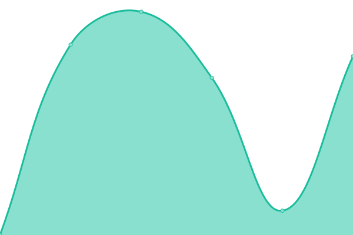

# [📈 Live Status](https://mai-status.wahleak.tech): <!--live status--> **🟧 Partial outage**

This repository contains the open-source uptime monitor and status page for [Chen zhaonuo](https://error063.work), powered by [Upptime](https://github.com/upptime/upptime).

With [Upptime](https://upptime.js.org), you can get your own unlimited and free uptime monitor and status page, powered entirely by a GitHub repository. We use [Issues](https://github.com/Error063/mai-status/issues) as incident reports, [Actions](https://github.com/Error063/mai-status/actions) as uptime monitors, and [Pages](https://mai-status.wahleak.tech) for the status page.

<!--start: status pages-->
<!-- This summary is generated by Upptime (https://github.com/upptime/upptime) -->
<!-- Do not edit this manually, your changes will be overwritten -->
<!-- prettier-ignore -->
| URL | Status | History | Response Time | Uptime |
| --- | ------ | ------- | ------------- | ------ |
|  [标题服务器](https://maimai-gm.wahlap.com:42081) | 🟥 Down | [.yml](https://github.com/Error063/mai-status/commits/HEAD/history/.yml) | 

 1266ms
     
 | 

<a href="https://mai-status.wahleak.tech/history/">80.86%</a>
    

|  [会员服务器](http://at.sys-all.cn) | 🟥 Down | [.yml](https://github.com/Error063/mai-status/commits/HEAD/history/.yml) | 

 1266ms
     
 | 

<a href="https://mai-status.wahleak.tech/history/">81.05%</a>
    

|  [Net认证](http://ai.sys-all.cn) | 🟩 Up | [net.yml](https://github.com/Error063/mai-status/commits/HEAD/history/net.yml) | 

 1620ms
     
 | 

<a href="https://mai-status.wahleak.tech/history/net">79.21%</a>
    

|  [玩家二维码](https://wq.sys-all.cn) | 🟥 Down | [.yml](https://github.com/Error063/mai-status/commits/HEAD/history/.yml) | 

 1266ms
     
 | 

<a href="https://mai-status.wahleak.tech/history/">81.30%</a>
    

|  [舞萌Net](https://maimai.wahlap.com) | 🟩 Up | [net.yml](https://github.com/Error063/mai-status/commits/HEAD/history/net.yml) | 

 1620ms
     
 | 

<a href="https://mai-status.wahleak.tech/history/net">79.53%</a>
    

<!--end: status pages-->

[**Visit our status website →**](https://mai-status.wahleak.tech)

## 📄 License

- Powered by: [Upptime](https://github.com/upptime/upptime)
- Code: [MIT](./LICENSE) © [Anand Chowdhary](https://anandchowdhary.com), supported by [Pabio](https://pabio.com)
- Data in the `./history` directory: [Open Database License](https://opendatacommons.org/licenses/odbl/1-0/)
